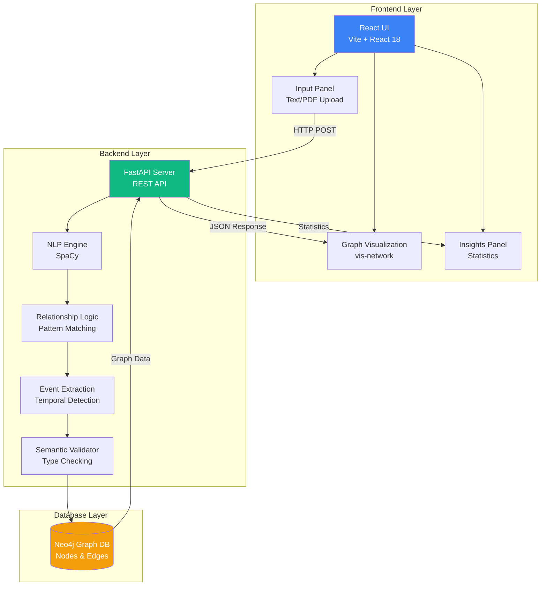
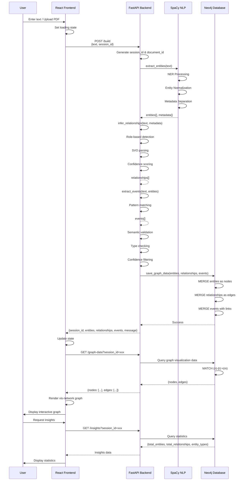
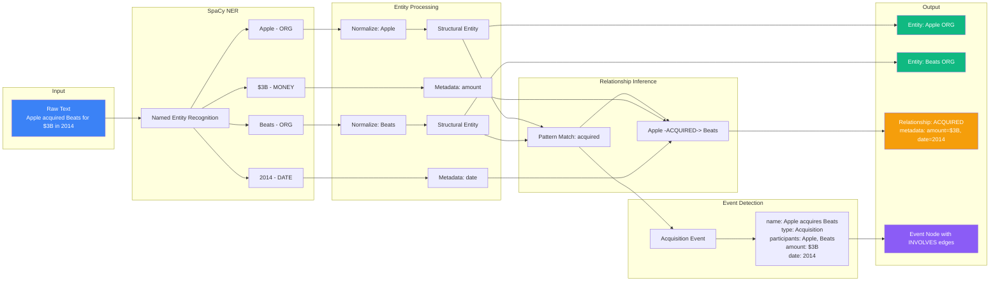
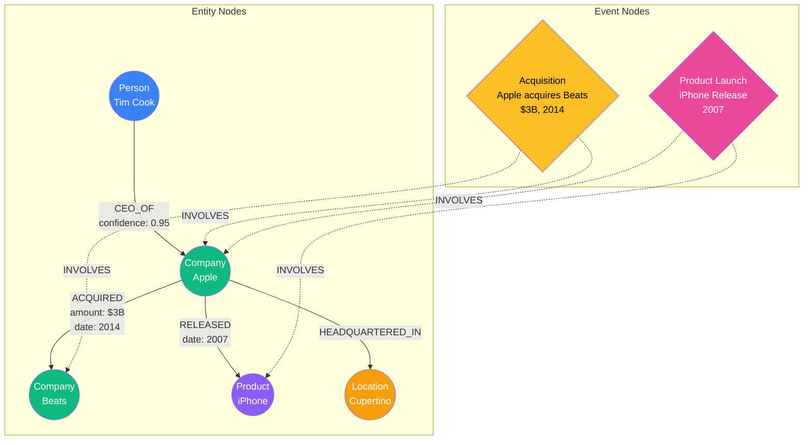

# Knowledge Graph Builder

A sophisticated knowledge graph construction system that extracts structured entities and relationships from unstructured text using advanced NLP techniques and semantic validation.

## Overview

Knowledge Graph Builder transforms natural language text into clean, semantically valid knowledge graphs. The system employs SpaCy for named entity recognition, applies strict semantic validation rules, and stores the resulting graph in Neo4j for visualization and querying.

## Architecture

The system consists of three main components:

### Backend (FastAPI)
- NLP processing engine with SpaCy
- Semantic validation layer
- Entity and relationship extraction
- Neo4j database integration
- RESTful API endpoints

### Frontend (React + Vite)
- Interactive text input interface
- Real-time graph visualization
- Session management
- PDF upload support

### Database (Neo4j)
- Graph data storage
- Cypher query interface
- Relationship traversal
- Data persistence

## 📊 System Flow Diagrams

### High-Level Architecture



### Complete Data Flow Pipeline

```mermaid
flowchart TD
    Start([User Input]) --> InputType{Input Type?}
    
    InputType -->|Text| TextInput[Text Input]
    InputType -->|PDF| PDFInput[PDF Upload]
    
    PDFInput --> PDFExtract[PyPDF2 Extraction]
    PDFExtract --> TextInput
    
    TextInput --> SessionID[Generate/Use Session ID]
    SessionID --> DocID[Generate Document ID]
    
    DocID --> NLPStart[NLP Processing Start]
    
    subgraph "NLP Processing Pipeline"
        NLPStart --> SpaCy[SpaCy NER<br/>en_core_web_sm]
        SpaCy --> EntityExtract[Extract Entities<br/>PERSON, ORG, GPE, etc.]
        EntityExtract --> EntityNorm[Entity Normalization<br/>Remove Inc., LLC]
        EntityNorm --> EntityCat[Entity Categorization<br/>Structural vs Metadata]
        EntityCat --> MetaSep[Separate Metadata<br/>DATE, MONEY, PERCENT]
    end
    
    MetaSep --> RelStart[Relationship Inference Start]
    
    subgraph "Relationship Extraction"
        RelStart --> RoleDetect[Role-Based Detection<br/>CEO_OF, FOUNDED]
        RoleDetect --> LocDetect[Location Patterns<br/>HEADQUARTERED_IN]
        LocDetect --> ProdDetect[Product Patterns<br/>PRODUCES, RELEASED]
        ProdDetect --> SVOParse[SVO Dependency Parsing<br/>Subject-Verb-Object]
        SVOParse --> ConfScore[Confidence Scoring<br/>0.6 - 1.0]
    end
    
    ConfScore --> EventStart[Event Detection Start]
    
    subgraph "Event Extraction"
        EventStart --> AcqDetect[Acquisition Detection]
        AcqDetect --> LaunchDetect[Product Launch Detection]
        LaunchDetect --> LeaderDetect[Leadership Change Detection]
        LeaderDetect --> EventLink[Link Events to Entities]
    end
    
    EventLink --> Validate[Semantic Validation]
    
    subgraph "Validation Layer"
        Validate --> TypeCheck[Type Constraint Check<br/>PERSON → COMPANY valid?]
        TypeCheck --> ConfFilter[Confidence Filter<br/>threshold ≥ 0.6]
        ConfFilter --> DedupCheck[Deduplication Check]
    end
    
    DedupCheck --> Neo4jSave[Save to Neo4j]
    
    subgraph "Neo4j Storage"
        Neo4jSave --> CreateNodes[Create Entity Nodes]
        CreateNodes --> CreateEdges[Create Relationship Edges]
        CreateEdges --> AttachMeta[Attach Metadata Properties<br/>date, amount, source]
    end
    
    AttachMeta --> Response[Build API Response]
    Response --> FrontendUpdate[Update Frontend State]
    
    FrontendUpdate --> VizRequest[Request Graph Data]
    VizRequest --> Neo4jQuery[Query Neo4j for Visualization]
    Neo4jQuery --> FormatData[Format for vis-network<br/>nodes & edges]
    FormatData --> Render[Render Interactive Graph]
    
    Render --> End([User Views Graph])
    
    style Start fill:#3b82f6,color:#fff
    style End fill:#10b981,color:#fff
    style Neo4jSave fill:#f59e0b,color:#fff
    style Validate fill:#ef4444,color:#fff
```



### API Request-Response Flow



### NLP Processing Detail



### Neo4j Graph Structure



## System Workflow

### 1. Text Input
Users submit unstructured text through the web interface or PDF upload.

### 2. NLP Processing
```
Input Text → SpaCy NER → Entity Extraction → Entity Type Correction → Semantic Filtering
```

**Entity Detection:**
- Extract named entities using SpaCy's en_core_web_sm model
- Apply entity type correction for known companies/products
- Force-detect common products (Echo, Alexa, etc.)
- Filter to allowed types: PERSON, COMPANY, PRODUCT, ORGANIZATION, LOCATION
- Remove metadata entities (DATE, MONEY, PERCENT) - stored as properties

**Supported Entity Types:**
- PERSON: Individuals, executives
- COMPANY: Corporations, businesses (normalized from ORG)
- PRODUCT: Commercial products, services
- ORGANIZATION: Non-profit organizations
- LOCATION: Cities, countries, regions (normalized from GPE)

### 3. Relationship Extraction
```
Entities + Text → Pattern Matching → Relationship Detection → Semantic Validation → Valid Relationships
```

**Extraction Strategies:**
- Role-based detection (CEO_OF, FOUNDED, EMPLOYED_BY)
- Location patterns (HEADQUARTERED_IN, LOCATED_IN)
- Product patterns (PRODUCES, RELEASED, DEVELOPS)
- Competition detection (COMPETES_WITH)
- List-based patterns ("such as X, Y, Z", "companies like X, Y, Z")
- SVO (Subject-Verb-Object) dependency parsing

**Supported Relationships:**
- FOUNDED: Person → Company
- CEO_OF / FORMER_CEO_OF: Person → Company (temporal distinction)
- EMPLOYED_BY: Person → Company/Organization
- PRODUCES / RELEASED / DEVELOPS: Company → Product
- OPERATES: Company → Organization
- LOCATED_IN / HEADQUARTERED_IN: Company → Location
- COMPETES_WITH: Company ← → Company
- COLLABORATES_WITH: Company ← → Company
- ACQUIRED: Company → Company

### 4. Semantic Validation
```
Extracted Relationships → Type Checking → Confidence Filtering → Validated Relationships
```

**Validation Rules:**
- Each relationship enforces entity type constraints
- Minimum confidence threshold (0.6)
- Invalid semantic triples are rejected
- Example: PERSON → PRODUCES → PRODUCT is invalid (requires COMPANY → PRODUCT)

### 5. Graph Storage
```
Validated Data → Neo4j Cypher Queries → Graph Database → Persistence
```

**Storage Strategy:**
- Entities stored as nodes with properties
- Relationships stored as edges with metadata
- Dates and monetary values attached as relationship properties
- Unique constraints on (entity name, entity type) pairs

### 6. Visualization
```
Neo4j Graph → Frontend API → React Force Graph → Interactive Visualization
```

**Visualization Features:**
- Color-coded nodes by entity type
- Directed relationship edges
- Interactive node exploration
- Session-based graph management

## Technical Stack

### Backend
- **Framework:** FastAPI
- **NLP:** SpaCy (en_core_web_sm)
- **Database:** Neo4j (Aura cloud or local)
- **Validation:** Custom semantic validator
- **Language:** Python 3.11+

### Frontend
- **Framework:** React 18
- **Build Tool:** Vite
- **Visualization:** react-force-graph
- **HTTP Client:** Fetch API
- **Language:** JavaScript (ES6+)

### Database
- **Graph DB:** Neo4j 5.x
- **Query Language:** Cypher
- **Driver:** neo4j-python-driver

## Installation

### Prerequisites
- Python 3.11 or higher
- Node.js 18 or higher
- Neo4j database (local or Aura cloud)

### Backend Setup
```bash
cd backend
python -m venv venv
source venv/bin/activate  # On Windows: .\venv\Scripts\Activate.ps1
pip install -r requirements.txt
python -m spacy download en_core_web_sm
```

Create `.env` file in backend directory:
```env
NEO4J_URI=bolt://localhost:7687
NEO4J_USER=neo4j
NEO4J_PASSWORD=your_password
```

Run backend server:
```bash
uvicorn app.main:app --reload --port 8000
```

### Frontend Setup
```bash
cd frontend
npm install
npm run dev
```

Frontend will be available at `http://localhost:5173`

## API Documentation

### Build Graph
**POST** `/build`

Request:
```json
{
  "text": "Amazon was founded by Jeff Bezos in 1994.",
  "session_id": "optional-session-id"
}
```

Response:
```json
{
  "session_id": "sess-abc123",
  "entities": [
    {"text": "Amazon", "type": "ORG"},
    {"text": "Jeff Bezos", "type": "PERSON"}
  ],
  "relationships": [
    {
      "source": "Jeff Bezos",
      "target": "Amazon",
      "type": "FOUNDED",
      "confidence": 0.95,
      "metadata": {"date": "1994"}
    }
  ],
  "events": [],
  "message": "Graph built: 2 entities, 1 relationships validated."
}
```

### Other Endpoints
- **POST** `/upload` - Upload PDF document
- **GET** `/graph-data?session_id=xxx` - Retrieve graph data
- **DELETE** `/clear?session_id=xxx` - Clear session graph
- **GET** `/insights?session_id=xxx` - Get graph insights

## Extraction Rules

### Entity Type Correction
The system automatically corrects SpaCy misclassifications:
- Alibaba (GPE) → Company (ORG)
- Kindle (GPE) → Product (PRODUCT)
- Echo (not detected) → Product (PRODUCT) via force detection

### List Pattern Detection
Handles multiple entities in lists:
- "produces devices such as Kindle, Echo, Fire TV" → 3 PRODUCES relationships
- "competes with Microsoft, Google, Alibaba" → 3 COMPETES_WITH relationships

### Temporal Role Detection
Distinguishes current vs. former roles:
- "Tim Cook is CEO of Apple" → CEO_OF
- "Steve Jobs was CEO of Apple" → FORMER_CEO_OF

## Development

### Project Structure
```
knowledge-graph-builder/
├── backend/
│   ├── app/
│   │   ├── main.py              # FastAPI application
│   │   ├── nlp_engine.py        # Entity extraction
│   │   ├── relationship_logic.py # Relationship detection
│   │   ├── extraction_rules.py   # Validation rules
│   │   ├── semantic_validator.py # Filtering logic
│   │   ├── graph_manager.py     # Neo4j interface
│   │   └── models.py            # Data models
│   ├── requirements.txt
│   └── README.md
├── frontend/
│   ├── src/
│   │   ├── App.jsx              # Main component
│   │   ├── components/          # UI components
│   │   └── services/api.js      # API client
│   ├── package.json
│   └── README.md
└── README.md
```

### Running Tests
```bash
# Backend tests
cd backend
pytest

# Frontend tests
cd frontend
npm test
```

## Configuration

### Environment Variables

**Backend (.env):**
```env
NEO4J_URI=bolt://localhost:7687
NEO4J_USER=neo4j
NEO4J_PASSWORD=password
MIN_CONFIDENCE_THRESHOLD=0.6
```

### Customization

**Add Custom Entity Types:**
Edit `backend/app/extraction_rules.py` and add to `AllowedEntityType` enum.

**Add Custom Relationships:**
1. Add to `AllowedRelationshipType` enum
2. Define semantic rules in `SEMANTIC_RULES` dict
3. Add detection patterns in `relationship_logic.py`

**Adjust Confidence Threshold:**
Modify `MIN_CONFIDENCE_THRESHOLD` in `relationship_logic.py`

## Troubleshooting

### Common Issues

**Neo4j Connection Failed:**
- Verify Neo4j is running
- Check credentials in `.env`
- Ensure correct URI format

**SpaCy Model Not Found:**
```bash
python -m spacy download en_core_web_sm
```

**CORS Errors:**
- Ensure backend allows frontend origin in `main.py`
- Check that frontend is running on expected port

**Missing Relationships:**
- Check backend console for validation logs
- Verify entity types are correct
- Ensure confidence threshold is not too high

## Performance Considerations

- **Text Length:** SpaCy max_length set to 2,000,000 characters
- **Deduplication:** Entity and relationship deduplication automatically applied
- **Database:** Neo4j constraints ensure data integrity
- **Caching:** Session-based caching for improved performance

## License

MIT License - See LICENSE file for details

## Contributing

Contributions are welcome. Please ensure:
- Code follows existing patterns
- Tests pass before submitting
- Documentation is updated
- Semantic validation rules are maintained

## Support

For issues or questions, please open a GitHub issue.
